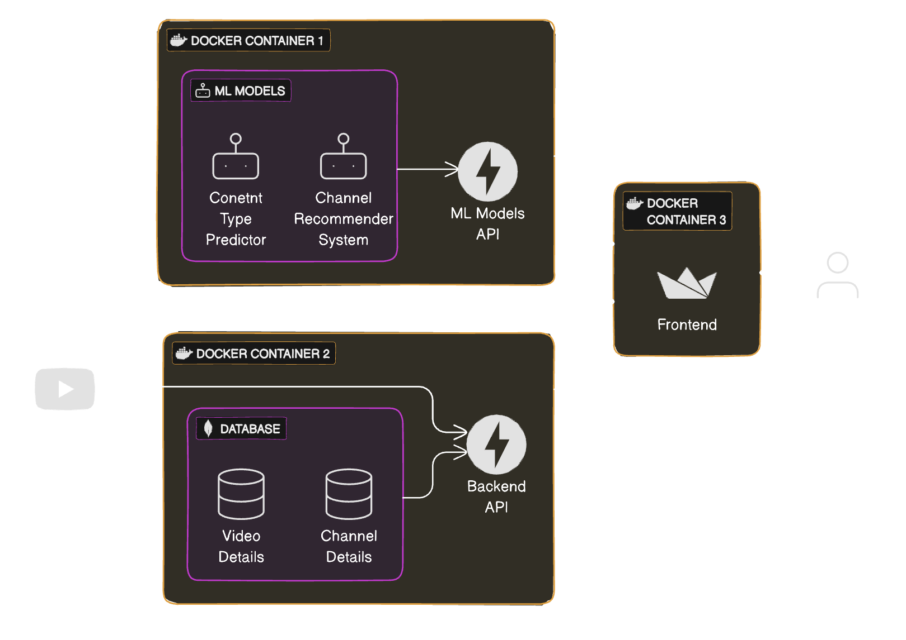

# YouTube Watch History Analyser - V2

Analyse you YouTube Watch History using Machine Learning, plot graphs, etc.

<p align=center>
  
</p>

## Working

### API (Backend)

- Used FastAPI to create backend APIs to interact with **MongoDB** database.
- Used **YouTube Data API v3** to fetch details about videos (you have watched).
- Used **Docker** to containerize the FastAPI application.

### ML (Models and API)

**Models**

1. **Video's Content Type Predictor**
   - Multiclass Classification Problem
   - Uses _Video Title_ to predict Content Type
2. **Channel Recommender System**
   - Recommender System
   - Uses user's channel subscriptions data to recommend channel

> \[!IMPORTANT\]
>
> By the way, I'm planning to upload the trained model to internet and
> model is download from URL to docker container once (if not exists).
>
> The model URL is provide through environment variable (`CTT_MODEL_URL`).
> If you want you can provide your model's URL.
>
> _This solution may works in short term_ 🤞

**API**

- Used **FastAPI** to serve model.
- Containerize FastAPI application and models using **Docker**.

> \[!CAUTION\]
>
> First, you have to train the ML model locally, and after that, start the docker
> container (because each containers are connected with their respective directories).
>
> **AUTHOR NOTE**: Fix this issue or find a better way to this.

### Frontend

- Used **Streamlit** to create multipage web application where users can upload their
  required data and see analysis.
- Requires **YouTube API Key** for advance analysis.
- Used **httpx** library to interact make requests to "Backend APIs" and "ML APIs".
- Used **Polars** for data manipulation.

### Apps Composition

- Wrote [docker-compose.yaml] script to build and run all three containers in one go.
- Used `mongodb` docker image as database, see [docker-compose.yaml].

## Setup

Clone this GitHub Repository

```bash
git clone https://github.com/arv-anshul/yt-watch-history-v2
cd yt-watch-history-v2
```

Train ML model [CTT model](ml/src/ctt/training.py) using below command:

```bash
cd ./ml
```

```bash
# Using rye
rye run python -m src.ctt.model

# Using python (activate virtual environment)
python -m src.ctt.model
```

Open **Docker Desktop** and run below command:

👀 See [docker-compose.yaml]

```bash
docker compose up --build  # First build the container and then run it (for first time)
```

## Roadmap

- [x] 🛠️ Build the basics from [yt-watch-history] project
- [x] 🎨 Draw diagrams for references
- [x] ⛓️ How to intergrate **pre-trained** ML Model
- [ ] 👷 Better CTT Model pipeline
- [ ] 📌 Integrate `mlflow` for ML Model monitoring
- [ ] 🤖 Build **Channel Recommender System**

[docker-compose.yaml]: docker-compose.yaml
[yt-watch-history]: https://github.com/arv-anshul/yt-watch-history
